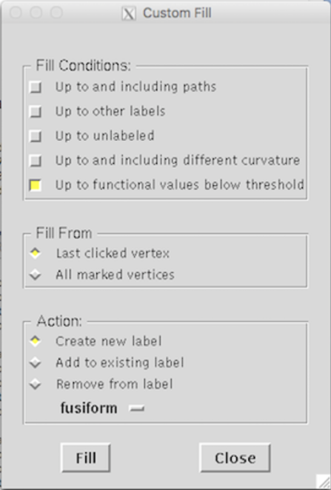

<!-- TOC depthFrom:1 depthTo:6 withLinks:1 updateOnSave:1 orderedList:0 -->

- [Draw ROIs on surface in FreeSurfer (tksurfer)](#draw-rois-on-surface-in-freesurfer-tksurfer)
- [Draw ROIs on surface with custom functions](#draw-rois-on-surface-with-custom-functions)

<!-- /TOC -->

# Draw ROIs on surface in FreeSurfer (tksurfer)

At first, FreeSurfer needs to be set properly in terminal:
   - `export FREESURFER_HOME=/Applications/freesurfer`
   - `source $FREESURFER_HOME/SetUpFreeSurfer.sh`
   - `export SUBJECTS_DIR=/full/path/to/subject/dir`
   - `cd to/the/functional/data/folder`

 
Then following steps should be repeated for each subject, analysis, contrast, and threshold. For example, we will draw a label of face-vs-object contrast (`f-vs-o`) for `subj1` on the left hemisphere (`lh`) with the threshold of `2` (i.e., 0.01).

1. Run the FreeSurfer command: `tksurfer-sess -s subjfunc -a analysis.lh -c f-vs-o -fthresh 2 -tksurfer`.
   - `tksurfer-sess`: the command to open the data file of a particular session;
   - `-s` (or `-subject`): subject name in the functional data;
   - `-a` (or `-analysis`): analysis name in the subject name folder;
   - `-c` (or `-contrast`): name of the contrast within the analysis folders;
   - `-fthresh`: the threshold used to show the overlay (2 is corresponding to p<0.01).
   - `-tksurfer`: only include this option when using FreeSurfer 6.0 (but not for earlier versions).
   - Then a `tksurfer` window will open and display an inflated brain with the overlay.
       
    
2. Based on the reference coordinates for the specific ROI, left click the activation cluster that is/includes the ROI.
   - You may rotate the brain by clicking the curly arrows (before clicking the cluster).
       
    
3. Click the `Custom Fill` icon, which is at the middle of the second row.
   - A new window called `Custom Fill` will open; select `Up to functional values below threshold` and then click `Fill`.
       
    
4. Save this label.
   - `File` -> `Label` -> `Save Selected Label...`;
       
   - Select where you would like to save the label and rename the label. Click `OK`.
       
    
5. Done. Click `File` -> `Quit` to quit.

 

# Draw ROIs on surface with custom functions
Please refer to help file for `fs_drawlabel()`.
