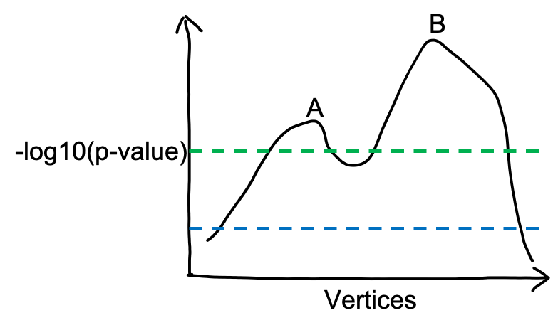
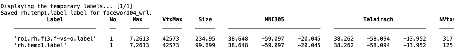

If you would like to only keep the vertices around a global maxima and their area size is say about/under 100 mm2, you may use `fs_trimlabel()` to trim the label of interests.

### The general procedures for updating the label file with maximum of 100 mm2 are as followings:
1. Identify a global maxima.
2. Identify the global maxima’s neighbor vertices, i.e., the vertices that are next to the global maxima.
3. Sort these neighbor vertices by their p-values and only the first 50% of them (i.e., vertices whose p-values are smaller) will be included as ROI vertices for this iteration.
4. The trimmed ROI vertices are the global maxima plus the vertices kept in step 3.
5. Then the vertices that are next to the trimmed ROI are identified.
6. Repeat step 3-5 until the label area reaches 100mm2.

### The global maxima
The global maxima (maybe I should call it local maxima) is defined as the vertex whose -log10(p-value) is larger than its neighbors after applying certain p-value threshold.
For example, when ** the blue threshold ** is applied, only B is identified as the global maxima. When ** the green threshold ** is applied, both A and B are global maxima. By default, only B is taken as a global maxima.

The steps for using `fs_trimlabel()` as followings:
1. run `fs_trimlabel(labelFn, sessCode, outPath, ‘method’, ‘maxresp’)`;
   - a screenshot (dispalys the gobal the global maxima (only one vertex) as a yellow circle on the inflated brain (highlighted in the red circle here);
   
    
   - The information of this global maxima (and its corresponding trimmed label) is displayed in Matlab command window (the below figure). The first row displays the information of the “old” label (before trimmed); the second row displays the information of the global maxima.
   
    
2. (a) If you **are** happy with this global maxima, you can type in the name of the trimmed label file. This label will be saved in the same folder as the “old” label; (Then you are finished trimming this label.)
   - **Note**: *if you type in the same name as the ”old” label, the ”old” label will be overwritten and cannot be recovered unless you re-create it with ‘tksurfer-sess’.*
2. (b) If you **are not** happy with this global maxima, type in ‘remove’ and this trimmed label file will be removed (please check the next slide). Then continue.
 
3. By default, `fs_trimlabel()` only tries to identify one global maxima. If you are not happy with it, you may set it to identify 2 global maxima (if there are more than one available) by adding `‘ncluster’, 2`.
   - run `fs_trimlabel(labelFn, sessCode, outPath, ‘method’, ‘maxresp’, ‘ncluster’, 2)`
   - Matlab will displays a preview of the two clusters. if you are still not happy with both of them, please type in `‘skip’` to skip these two clusters. (Maybe increase `‘ncluster’` further).
   
    
   - Otherwise, click ‘OK‘ to continue (it will continue as long as the strings in the input box is not ‘skip’). You will get a warning if the two clusters overlaps, just click ‘OK’. Next, it will repeat the previous steps to check the two clusters sequentially.
