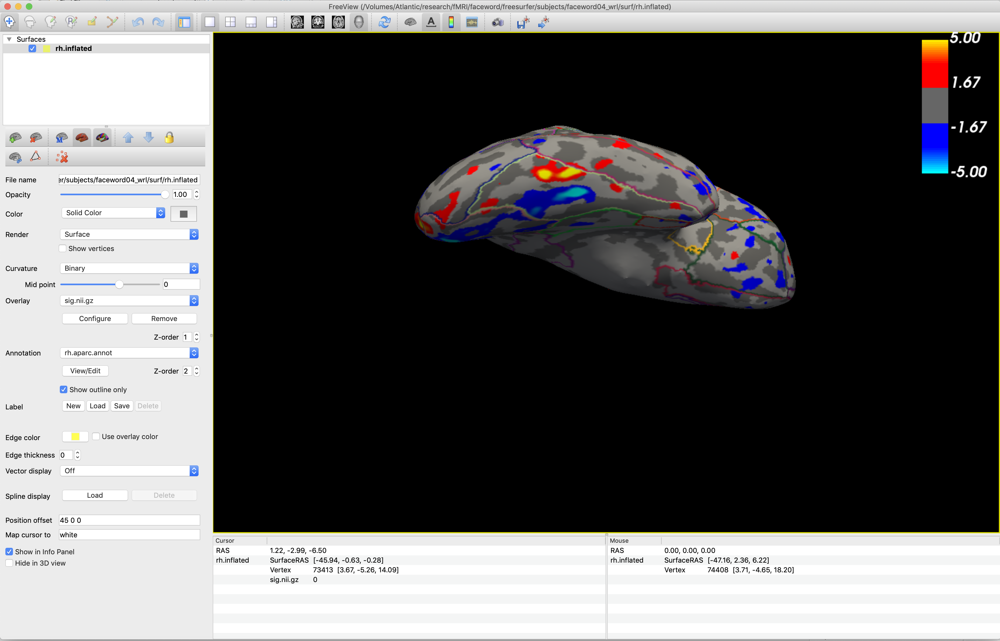

<!-- TOC depthFrom:1 depthTo:6 withLinks:1 updateOnSave:1 orderedList:0 -->

- [Visualize the first-level results](#visualize-the-first-level-results)
	- [With freeview](#with-freeview)
	- [With tksurfer](#with-tksurfer)
	- [With custom functions](#with-custom-functions)
- [Visualize the second-level results](#visualize-the-second-level-results)
	- [With freeview](#with-freeview)
	- [With tksurfer](#with-tksurfer)
	- [With custom functions](#with-custom-functions)

<!-- /TOC -->

Here I introduce some ways to visualize the first- and second-level results for individual subject on the brain surfaces (with the FreeSurfer data structure).

Some (redundant) notes: you always have to set up FreeSurfer properly before using freeview or tksurfer ([steps](fs_setup.md)).

# Visualize the first-level results
## With freeview
Note: it is similar to the first steps of [drawing surface roi with freeview](draw_surface_roi.md#draw-rois-on-surface-in-freesurfer-60-or-earlier-via-tksurfer). Additional information is available in [the FreeSurfer website](https://surfer.nmr.mgh.harvard.edu/fswiki/FsFastTutorialV6.0/FsFastFirstLevel#VisualizetheFirstLevelOutput).

Run the FreeSurfer command:
`tksurfer-sess -s subjfunc -a analysis.lh -c f-vs-o -fthresh 2` (for FreeSurfer 7.1 or later).
`tksurfer-sess -s subjfunc -a analysis.lh -c f-vs-o -fthresh 2 -freeview` (for FreeSurfer 6.0).
   - `tksurfer-sess`: the command to open the data file of a particular session;
   - `-s` (or `-subject`): subject name in the functional data;
   - `-a` (or `-analysis`): analysis name in the subject name folder;
   - `-c` (or `-contrast`): name of the contrast within the analysis folders;
   - `-fthresh`: the threshold used to show the overlay (2 is corresponding to p<0.01).
   - Then a `freeview` window will open and display an inflated brain with the overlay.
       
    

Then you may rotate the brain and get a screenshot.

## With tksurfer
Note: it is similar to the first steps of [drawing surface roi with tksurfer](draw_surface_roi.md#draw-rois-on-surface-in-freesurfer-710-or-later-via-freeview). Additional information is available in [the FreeSurfer website](https://surfer.nmr.mgh.harvard.edu/fswiki/FsFastTutorialV6.0/FsFastFirstLevel#VisualizetheFirstLevelOutput).

Run the FreeSurfer command: `tksurfer-sess -s subjfunc -a analysis.lh -c f-vs-o -fthresh 2 -tksurfer`.
   - `tksurfer-sess`: the command to open the data file of a particular session;
   - `-s` (or `-subject`): subject name in the functional data;
   - `-a` (or `-analysis`): analysis name in the subject name folder;
   - `-c` (or `-contrast`): name of the contrast within the analysis folders;
   - `-fthresh`: the threshold used to show the overlay (2 is corresponding to p<0.01).
   - `-tksurfer`: only include this option when using FreeSurfer 6.0 (but not for earlier versions).
   - Then a `tksurfer` window will open and display an inflated brain with the overlay.
       
    

You may rotate the brain by clicking the curly arrows (before clicking the cluster) and then get a screenshot.
    
 

## With custom functions
Please refer to help file for [`fs_cvn_print1st()`](../cvn/fs_cvn_print1st.m).

# Visualize the second-level results
## With freeview
Run the FreeSurfer command: `tksurferfv fsaverage lh inflated -aparc -overlay my-glm/osgm/sig.nii.gz -fminmax 2 3`
- `fsaverage`: display the results on the `fsaverage` surface;
- `lh` (or `rh`): left (or right) hemisphere;
- `inflated`: display the inflated brain;
- `-aparc`: display the aparc annotation;
- `-overlay`: path to the activation file;
- `-fminmax`: the threshold used to show the overlay (2 and 3 are corresponding to -p-value of 0.01 and 0.001, respectively).

## With tksurfer
Run the FreeSurfer command: `tksurfer fsaverage lh inflated -aparc -overlay my-glm/osgm/sig.nii.gz -fminmax 2 3`
- `fsaverage`: display the results on the `fsaverage` surface;
- `lh` (or `rh`): left (or right) hemisphere;
- `inflated`: display the inflated brain;
- `-aparc`: display the aparc annotation;
- `-overlay`: path to the activation file;
- `-fminmax`: the threshold used to show the overlay (2 and 3 are corresponding to -p-value of 0.01 and 0.001, respectively).

## With custom functions
Please refer to help file for [`fs_cvn_print2nd()`](../cvn/fs_cvn_print2nd.m).
