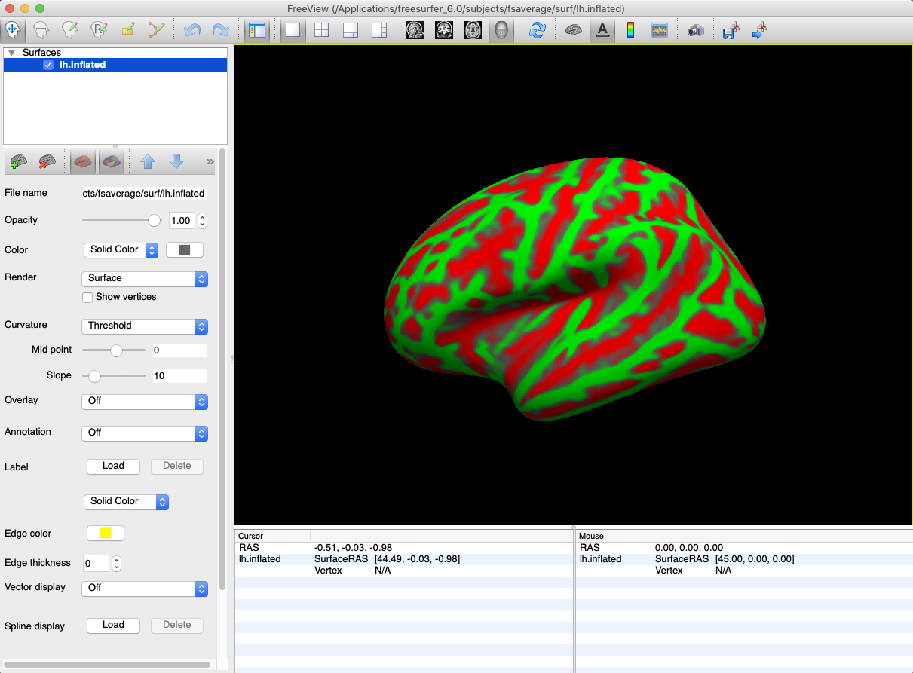
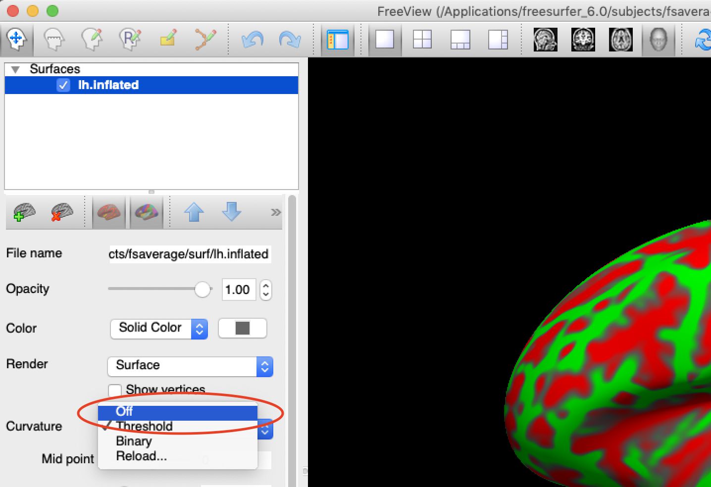
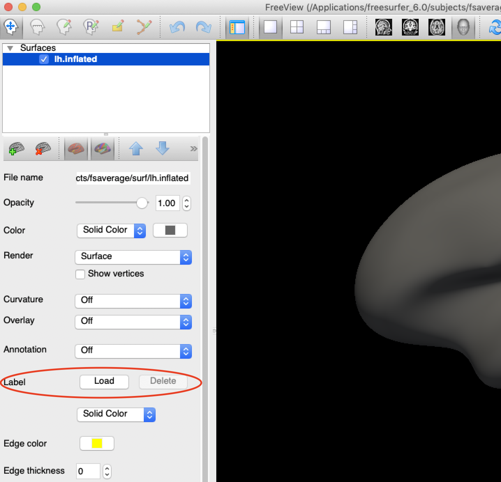
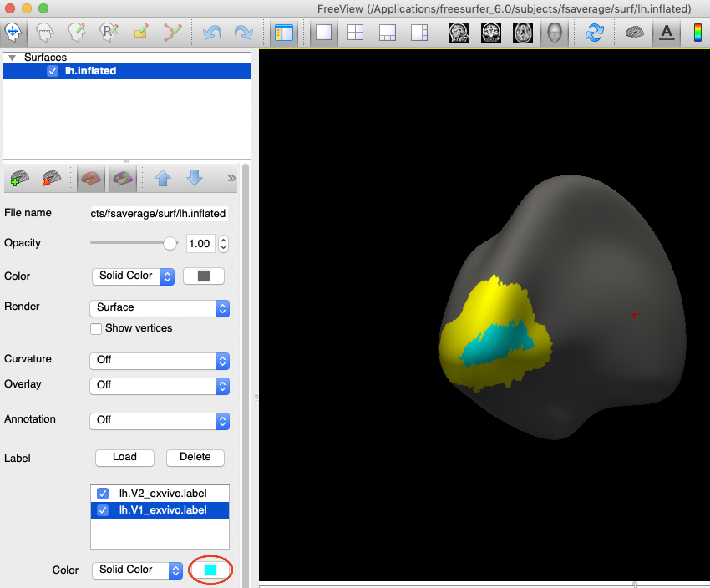
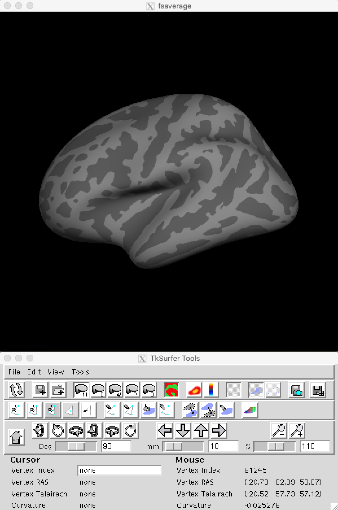
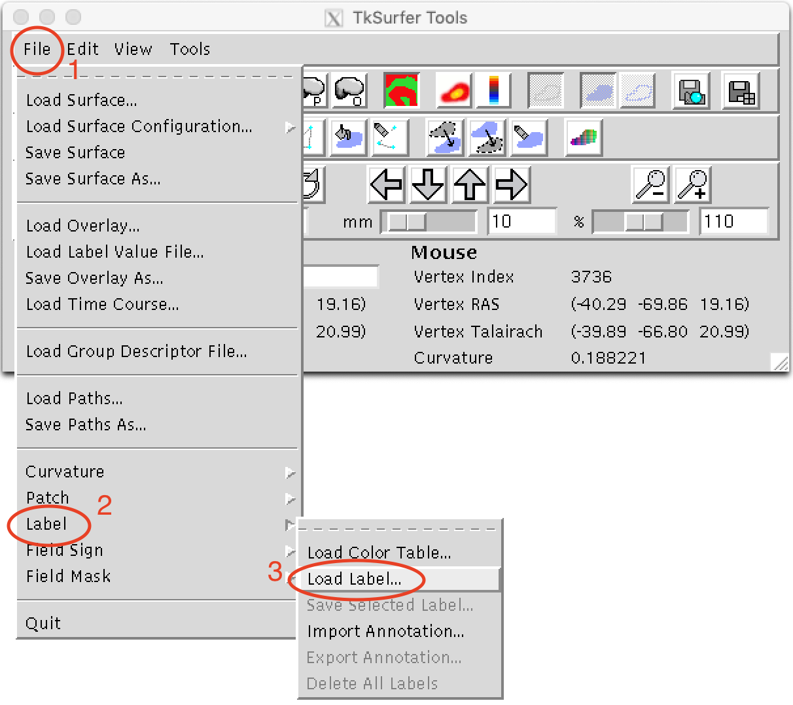
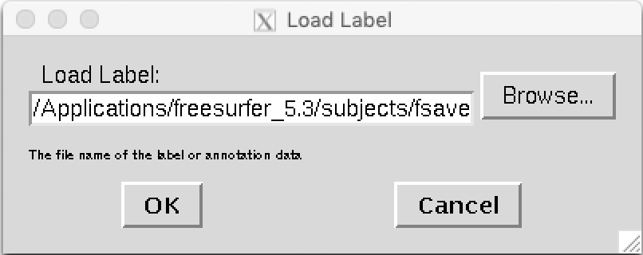
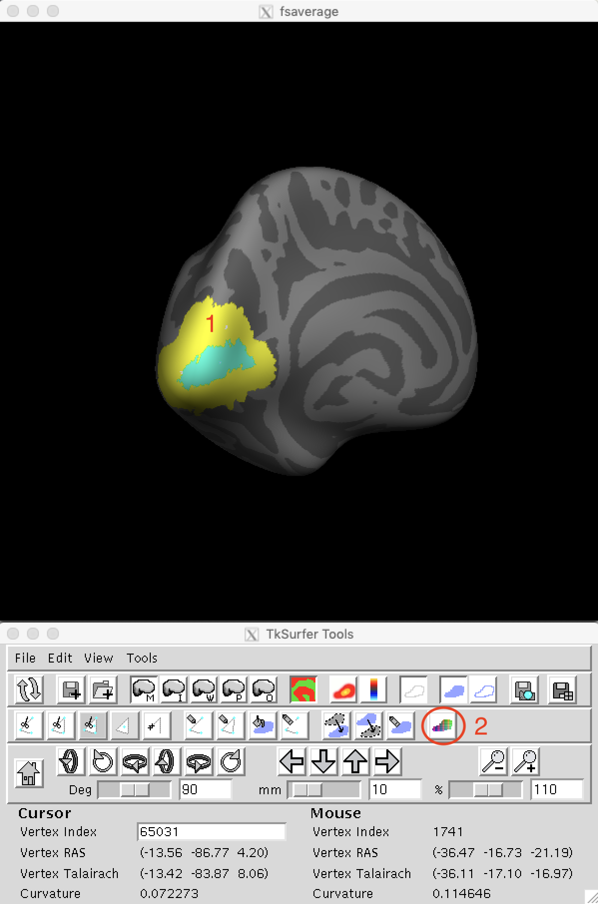
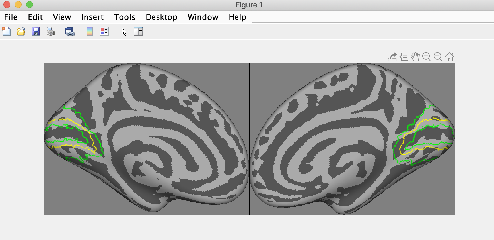

<!-- TOC depthFrom:1 depthTo:6 withLinks:1 updateOnSave:1 orderedList:0 -->

- [Visualize labels (ROIs)](#visualize-labels-rois)
  - [With freeview (FreeSurfer 6.0 or later)](#with-freeview-freesurfer-60-or-later)
  - [With tksurfer (FreeSurfer 6.0 or earlier)](#with-tksurfer-freesurfer-60-or-earlier)
  - [With cvn codes](#with-cvn-codes)
  - [With custom functions](#with-custom-functions)

<!-- /TOC -->

# Visualize labels (ROIs)

Here are some ways to visualize the label files (i.e., ROI) for each subject and each hemisphere separately.

Some (redundant) notes: you always have to set up FreeSurfer properly before using freeview or tksurfer ([steps](fs_setup.md)).

## With freeview (FreeSurfer 6.0 or later)

1. Load the surface for one subject with (in terminal): 
    ```shell
    tksurferfv fsaverage lh inflated
    ```
    - `fsaverage`: display the results on the `fsaverage` surface, it could be any subject code (i.e., folder name in `$SUBJECTS_DIR`);
    - `lh` (or `rh`): left (or right) hemisphere;
    - `inflated`: display the inflated brain;

    
<br>

2. (optional) Turn off the "red-green" color by set the `Curvature` as `Off` or `Binary`.
    
<br>

3. Load label(s).
    
    <br>
    You may visualize multiple labels with different colors (do not forget to rotate the brain to get the best view).
    
<br>


## With tksurfer (FreeSurfer 6.0 or earlier)

1. Load the surface for one subject with: 
    ```shell
    tksurfer fsaverage lh inflated -curv -gray
    ```
    - `fsaverage`: display the results on the `fsaverage` surface, it could be any subject code (i.e., folder name in `$SUBJECTS_DIR`);
    - `lh` (or `rh`): left (or right) hemisphere;
    - `inflated`: display the inflated brain;
    - `-curv`: show the curvature;
    - `-gray`: show the curvature as gray.

    
<br>

2. Load the label file via `File` -> `Label` -> `Load label...`.  
    
<br>

3. A window will open and select the label(s) you would like to display.  
    
<br>

4. You may also change the color of labels by clicking the label on the surface and then choose the color you want.
    
<br>

## With cvn codes
[knkutils](https://github.com/kendrickkay/knkutils.git) and [cvncode](https://github.com/kendrickkay/cvncode.git) are super useful for visualizing fMRI results on brain surfaces (in Matlab).

An example Matlab code to display bilateral V1 and V2 for fsaverage is as following:
```matlab
% set SUBJECTS_DIR for FreeSurfer
subjdir = '/full/path/to/subject/dir';
setenv('SUBJECTS_DIR', subjdir);

% get the number of vertices
vtx_lh = read_surf(fullfile(subjdir, 'fsaverage', 'surf', 'lh.white'));
vtx_rh = read_surf(fullfile(subjdir, 'fsaverage', 'surf', 'rh.white'));
nVtx_lh = size(vtx_lh, 1);
nVtx_rh = size(vtx_rh, 1);

% load the labels
label_v1_lh = read_label('fsaverage', 'lh.V1_exvivo');
label_v2_lh = read_label('fsaverage', 'lh.V2_exvivo');
label_v1_rh = read_label('fsaverage', 'rh.V1_exvivo');
label_v2_rh = read_label('fsaverage', 'rh.V2_exvivo');

% convert the label file into binary roimask
roi_v1 = zeros(nVtx_lh + nVtx_rh, 1);
roi_v1([label_v1_lh(:, 1)+1; label_v1_rh(:, 1)+1+nVtx_lh], 1) = 1;
roi_v2 = zeros(nVtx_lh + nVtx_rh, 1);
roi_v2([label_v2_lh(:, 1)+1; label_v2_rh(:, 1)+1+nVtx_lh], 1) = 1;

rois = cell(2, 1);
rois{1} = logical(roi_v1);
rois{2} = logical(roi_v2);

% create "dummy" data
data = zeros(nVtx_lh + nVtx_rh, 1);

% display the ROIs
cvnlookup('fsaverage', 5, data, '', '', 1i, '', '', ...
    {'roimask', rois, 'roicolor', {'y', 'g'}});
```

Note:
1. You may have to copy the fsaverage to somewhere you have rights to write for running this example.
2. `read_label()` and `read_surf()` are FreeSurfer Matlab functions. You need to add these functions to the Matlab path. These FreeSurfer Matlab functions should be at e.g., `/Applications/FreeSurfer/matlab`.
3. For the arguments in `cvnlookup()`, please check its [help file](https://github.com/kendrickkay/cvncode/blob/master/cvnlookup.m).

The output should be something like:

<br>


## With custom functions
Please refer to help file for [`fs_cvn_printlabel()`](../cvn/fs_cvn_printlabel.m).
